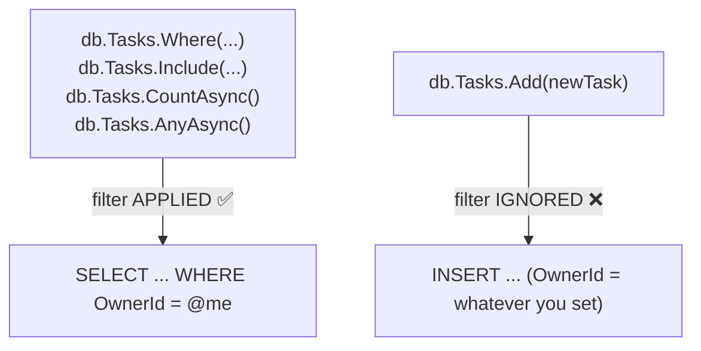

# Global Query Filters & Per-User Data Scoping in EF Core

`HasQueryFilter` attaches a `WHERE` clause to **every query EF Core generates** for an
entity type. It is the mechanism behind both multi-tenancy (`OwnerId == currentUser.Id`)
and soft deletes (`!IsDeleted`) — one feature, two of the roadmap's paths.

Its appeal is that you cannot forget it. Its danger is exactly the same: it is invisible at
the call site.

---

## 1. Where It Goes

```csharp
public class AppDbContext(
    DbContextOptions<AppDbContext> options,
    ICurrentUser currentUser) : DbContext(options)
{
    protected override void OnModelCreating(ModelBuilder modelBuilder)
    {
        base.OnModelCreating(modelBuilder);
        modelBuilder.ApplyConfigurationsFromAssembly(typeof(AppDbContext).Assembly);

        modelBuilder.Entity<TaskItem>().HasQueryFilter(t => t.OwnerId == currentUser.Id);
        modelBuilder.Entity<Category>().HasQueryFilter(c => c.OwnerId == currentUser.Id);
        modelBuilder.Entity<Tag>().HasQueryFilter(t => t.OwnerId == currentUser.Id);
    }
}
```

Now this handler:

```csharp
await db.Tasks.Where(t => t.Id == id).FirstOrDefaultAsync(ct);
```

emits this SQL:

```sql
SELECT ... FROM "Tasks" AS t
WHERE t."OwnerId" = @__currentUser_Id_0 AND t."Id" = @__id_1
```

The handler code did not change. The `WHERE` appeared anyway.

---

## 2. ⚠️ The Asymmetry: Reads Filtered, Writes Not

This is the single biggest source of query-filter bugs.



A query filter is part of **query** translation. `Add()` is not a query. Nothing sets
`OwnerId` for you:

```csharp
// CreateTask.cs — REQUIRED, the filter will not do this
var task = new TaskItem
{
    Title = req.Title,
    OwnerId = currentUser.RequireId(),   // ← forget this and the row is orphaned at OwnerId = 0
};
```

Every insert path needs it: `CreateTask`, `CreateCategory`, `CreateTag`. And note the
second-order effect — a row inserted with `OwnerId = 0` **immediately becomes invisible to
its creator**, because the filter now excludes it. The symptom is "I created it and it
vanished", which looks nothing like the actual cause.

Updates and deletes are safer than inserts, because the entity had to be *loaded* first —
and the load was filtered. `db.Tasks.Remove(taskYouFetched)` is fine. But
`ExecuteUpdateAsync` / `ExecuteDeleteAsync` run as direct SQL, and those **do** respect the
filter, since they are built from a queryable.

---

## 3. Filters and Navigations

The filter applies wherever the entity appears in a query, including through navigations:

```csharp
db.Tasks.Include(t => t.Subtasks)   // Subtask has NO filter — but reaching it
                                    // required loading a filtered TaskItem first
```

That is why `Subtask` needs no `OwnerId`. It is not addressable on its own — the only route
to it is `/api/tasks/{id}/subtasks`, and that route loads a `TaskItem` through the filter.
This is the **aggregate root** rule: the root is guarded, so the children inherit the guard.

### The `RequiredNavigationWithQueryFilter` warning

If a *filtered* entity is on the required side of a relationship with an *unfiltered* one,
EF Core warns you. Example: `TaskItem.Owner` is required (`User` is not filtered) — but
`Subtask.Task` required, pointing at filtered `TaskItem`, is the shape that trips it. The
concern is real: a filter can make a required navigation resolve to `null`, which the model
says is impossible.

If you hit it, the honest options are to filter both sides consistently or to make the
navigation optional. Suppressing the warning without understanding which case you are in is
how you get a `NullReferenceException` in production.

---

## 4. `ICurrentUser` Must Tolerate "No User"

```csharp
public interface ICurrentUser
{
    int? Id { get; }      // nullable ON PURPOSE
    int RequireId();      // throws — for write paths only
}
```

The filter compares against `currentUser.Id` (nullable), **never** `RequireId()`. Three
situations have no HTTP request in flight:

| Situation | `Id` | Result |
| :--- | :--- | :--- |
| `dotnet ef migrations add` | `null` | Model builds fine. If it threw, migrations would break. |
| Anonymous request (`/api/auth/login`) | `null` | Filter matches nothing — the safe direction. |
| `BackgroundService` (Path 4) | `null` | **Filter hides everything** — see below. |

Note what the null case does: `OwnerId == null` matches no row, so an unauthenticated caller
sees an empty result rather than everyone's data. **Fail closed.** Had you written
`currentUser.Id == null || t.OwnerId == currentUser.Id`, it would fail *open* and leak the
entire table to anonymous callers. The nullable comparison is doing real security work.

### The DbContext-now-depends-on-HTTP tradeoff

`AppDbContext` now takes `ICurrentUser`, which takes `IHttpContextAccessor`. Your data layer
has acquired a dependency on the web layer. That is the price of the filter, and it is
usually worth paying — but it is why Path 4's background worker needs:

```csharp
// Inside the BackgroundService scope — no HTTP request, so no user.
var overdue = await db.Tasks
    .IgnoreQueryFilters()
    .Where(t => t.DueDate < today && !t.IsDone)
    .ToListAsync(ct);
```

---

## 5. `IgnoreQueryFilters()` — the Escape Hatch

```csharp
db.Tasks.IgnoreQueryFilters().Where(t => t.Id == id)
```

Turns off **all** filters for that query — not one, all. Legitimate uses: background jobs,
an admin "view any user's data" feature, a data-repair script.

Treat every call site as security-relevant. `grep -rn "IgnoreQueryFilters" server/` should
return a short list you can justify line by line. It is the one call that can undo the whole
scoping model.

---

## 6. Filters Compose With `AND`, and There Is Only One Per Entity

Calling `HasQueryFilter` twice on the same entity **replaces** the first filter (in EF Core
versions before 10 — EF Core 10 added named filters allowing multiple). To combine
soft-delete and ownership, write one expression:

```csharp
modelBuilder.Entity<TaskItem>()
    .HasQueryFilter(t => t.OwnerId == currentUser.Id && !t.IsDeleted);
```

Relevant when you come back and do Path 2's soft-delete feature on top of Path 3.

---

## 7. Why Build It the Explicit Way First

The alternative — `.Where(t => t.OwnerId == currentUser.RequireId())` in all ~15 handlers —
teaches something the filter hides:

| | Explicit `Where` | Global filter |
| :--- | :--- | :--- |
| Visible in handler code | Yes | No |
| Forgettable | **Yes — one miss is a data leak** | No |
| Works on inserts | N/A | No (§2) |
| Effort to add an entity | Touch every handler | One line |
| Debuggability | Obvious | Needs the generated SQL to see it |

Write two handlers explicitly, deliberately leave `UpdateTask` unfiltered, and watch user B
successfully edit user A's task. Then add the filter and watch the same request 404. The
filter stops being magic and starts being a tool you know the shape of.

---

## Related

- [IDOR and 404 vs 403](./IDOR%20and%20404%20vs%20403.md) — the bug class this prevents
- [JWT Structure and Claims](./JWT%20Structure%20and%20Claims.md) — where `currentUser.Id` comes from
- [Child Entities and Cascade Deletes](../Relationships/Child%20Entities%20and%20Cascade%20Deletes.md) — the aggregate-root reasoning behind unfiltered `Subtask`
