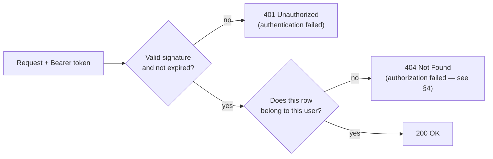

# IDOR, and Why Scoped Resources Return 404 Instead of 403

**Authentication** answers *who are you*. **Authorization** answers *are you allowed to
touch this specific row*. Passing the first and skipping the second is the most commonly
shipped security bug in REST APIs — and it is invisible in code review, because the bug is
the absence of a line rather than the presence of a wrong one.

---

## 1. Authentication vs Authorization



`.RequireAuthorization()` only implements the **first** diamond. Despite the name, with no
policy argument it means "any authenticated user", which is authentication, not
authorization. The second diamond is entirely your job — and in TaskTracker it is done by
the global query filter.

---

## 2. IDOR by Example

**IDOR — Insecure Direct Object Reference:** the API accepts an object identifier from the
client and acts on it without checking the caller owns it.

```csharp
// UpdateTask.cs — logged in, token valid, and completely broken.
private static async Task<IResult> Handle(
    int id, UpdateTaskRequest req, AppDbContext db, CancellationToken ct)
{
    var task = await db.Tasks.FirstOrDefaultAsync(t => t.Id == id, ct);
    if (task is null) return Results.NotFound();

    task.Title = req.Title;          // whose task? nobody asked.
    await db.SaveChangesAsync(ct);
    return Results.NoContent();
}
```

Reproduce it deliberately:

```text
1. Register alice@test.com, log in, POST /api/tasks   → task id 1
2. Register bob@test.com,   log in
3. As Bob:  PUT /api/tasks/1  { "title": "owned" }    → 204 No Content   ← Bob just edited Alice's task
```

Bob was authenticated the whole time. Every log line looks normal. Nothing threw.

Sequential integer ids make it trivial to enumerate — `GET /api/tasks/1`, `2`, `3`… walks
the entire table. GUID ids raise the effort but **do not fix it**: an id that leaks anywhere
(a URL, a shared screenshot, a referrer header) still works. "Unguessable identifier" is
obfuscation; an ownership check is a control.

---

## 3. Status Codes: 401 vs 403 vs 404

| Code | Means | Send when |
| :--- | :--- | :--- |
| **401 Unauthorized** | *Unauthenticated* — the name is a historical misnomer | No token, expired token, bad signature. Handled by `UseAuthentication`. |
| **403 Forbidden** | Authenticated, identity understood, action refused | The resource's existence is **not** a secret — e.g. role gates: "you are not an admin" |
| **404 Not Found** | No such resource *for you* | **Per-user scoped resources — TaskTracker's case** |

---

## 4. Why 404 for Someone Else's Task

Return 403 for `GET /api/tasks/1` and you have just told the caller:

> *task 1 exists, and it belongs to someone who is not you.*

Now compare that against a 404 for `GET /api/tasks/9999`. The difference between the two
responses is an **existence oracle**: an attacker sweeps ids, sorts 403 from 404, and maps
exactly how many tasks your system holds and which id ranges are live. They learn your
growth rate, your active users, your data volume — without reading a single task.

**404 makes both cases indistinguishable.** From Bob's perspective, Alice's task simply does
not exist. That is not a lie; scoped correctly, it is the literal truth of Bob's view of the
system.

The rule: **403 when the resource's existence is not confidential; 404 when it is.** Role
checks get 403 ("you're not an admin" reveals nothing about data). Row-ownership checks get
404.

---

## 5. The Fix Is Structural, Not Per-Handler

The tempting fix is a guard in every handler:

```csharp
if (task.OwnerId != currentUser.RequireId()) return Results.NotFound();
```

Correct — and load-bearing on a human remembering it 15 times, plus every handler added
later, forever. A single omission is a silent breach with no error and no log.

The structural fix makes the row *unreachable* rather than *rejected*:

```csharp
modelBuilder.Entity<TaskItem>().HasQueryFilter(t => t.OwnerId == currentUser.Id);
```

Bob's query for task 1 now returns `null`. The existing line —

```csharp
return task is not null ? Results.Ok(task) : Results.NotFound();
```

— already produces the correct 404, with no security-specific code in the handler at all.
The right code shape is the one where the vulnerable version is the one you have to go out
of your way to write.

See [Global Query Filters and Data Scoping](./Global%20Query%20Filters%20and%20Data%20Scoping.md) for the mechanics, including the write paths the filter does **not** cover.

---

## 6. Checklist for Every New Endpoint

- [ ] Does it take an id from the client? → is that id scoped to the caller?
- [ ] Is it a **write**? → the query filter does not apply to `Add()`. Set `OwnerId` explicitly.
- [ ] Does it accept an id in the **body** as well as the route? (`categoryId`, `tagIds` on `UpdateTask` — each is its own IDOR surface. Assigning your task to someone else's category is the same bug wearing a different hat.)
- [ ] Does it return a **count** or aggregate? A total that includes other users' rows leaks just as surely as a list.
- [ ] Is it a bulk operation? `PUT /api/tasks/mark-all` marking *everyone's* tasks done is IDOR at scale.
- [ ] Does it call `IgnoreQueryFilters()`? → justify it in a comment.
- [ ] Would the `.http` check catch a regression here?

`MarkAllTasks.cs` is the one worth checking first when you get to Phase A — a bulk update
with no `WHERE` on owner is the highest-blast-radius version of this bug in the codebase.

---

## Related

- [Global Query Filters and Data Scoping](./Global%20Query%20Filters%20and%20Data%20Scoping.md) — the mechanism
- [JWT Structure and Claims](./JWT%20Structure%20and%20Claims.md) — where the caller's identity comes from
- [Password Hashing](./Password%20Hashing.md) — user enumeration, the same information-leak principle applied to login
