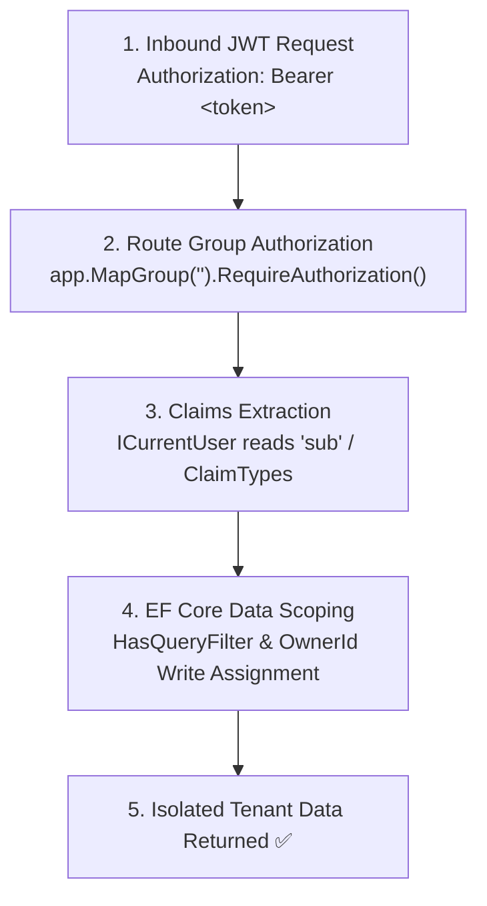
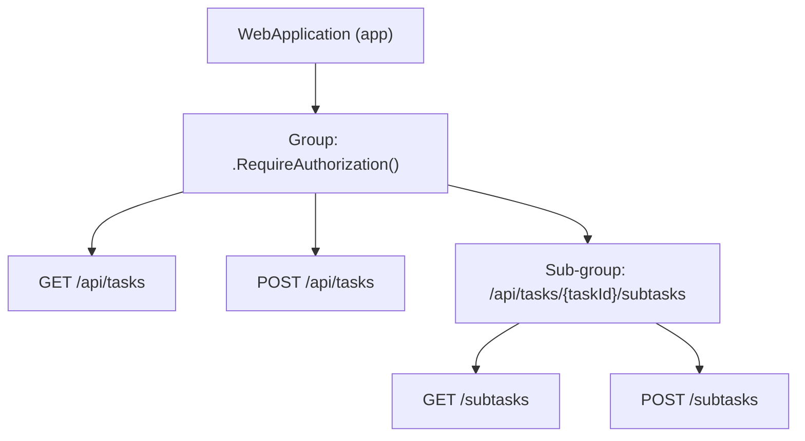
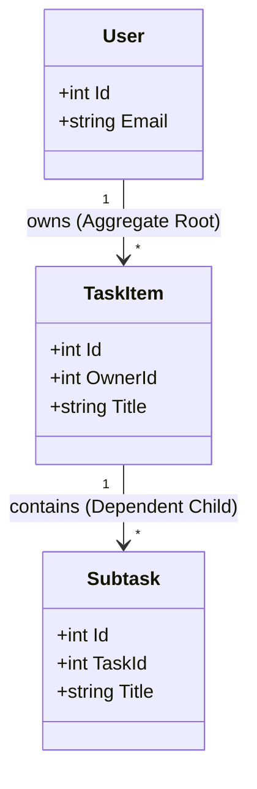

# JWT Claims, Route Groups & Tenant Scoping in .NET

Building secure, multi-user APIs in ASP.NET Core Minimal APIs requires three foundational layers working in complete unison:



When any of these layers has a mismatch, you risk runtime exceptions, authentication bypasses, or cross-tenant data leaks. This guide explains how each layer works, common traps to avoid, and the architecture behind TaskTracker.

---

## 1. JWT Claims & Inbound Claim Type Mapping

A **claim** is a key-value statement about the user signed inside the JWT payload (e.g., `sub: "42"`, `email: "alice@example.com"`).

### The Inbound Claim Mapping Trap

ASP.NET Core has a legacy feature originating from WIF (Windows Identity Foundation) that rewrites standard JWT claim names into long XML schema URIs:

| JWT Standard Claim (`JwtRegisteredClaimNames`) | Default Inbound Renamed Claim (`ClaimTypes`) |
| :--- | :--- |
| `"sub"` | `http://schemas.xmlsoap.org/ws/2005/05/identity/claims/nameidentifier` |
| `"email"` | `http://schemas.xmlsoap.org/ws/2005/05/identity/claims/emailaddress` |
| `"role"` | `http://schemas.microsoft.com/ws/2008/06/identity/claims/role` |

If you turn off this rewriting in `Program.cs` via:

```csharp
// Program.cs
JwtSecurityTokenHandler.DefaultInboundClaimTypeMap.Clear();
```

Then inbound claims remain exactly as named in the JWT: `"sub"` stays `"sub"`.

### ⚠️ The Mismatch Bug

If `DefaultInboundClaimTypeMap.Clear()` is called, but your `CurrentUser` service reads `ClaimTypes.NameIdentifier`, `User.FindFirstValue(...)` returns `null`!

```csharp
// ❌ FAILS when DefaultInboundClaimTypeMap is cleared:
var idStr = user.FindFirstValue(ClaimTypes.NameIdentifier); // returns null!
```

### The Bulletproof Solution: Check Both & Parse Safely

To ensure your code never breaks regardless of mapping configuration or token format, check both claim names and parse the integer safely:

```csharp
// Common/ICurrentUser.cs
public sealed class CurrentUser(IHttpContextAccessor accessor) : ICurrentUser
{
    public int? Id
    {
        get
        {
            var user = accessor.HttpContext?.User;
            if (user is null) return null;

            // Check standard JWT "sub" first, fallback to mapped NameIdentifier
            var subClaim = user.FindFirstValue(JwtRegisteredClaimNames.Sub)
                        ?? user.FindFirstValue(ClaimTypes.NameIdentifier);

            return int.TryParse(subClaim, out var id) ? id : null;
        }
    }

    public int RequireId() =>
        Id ?? throw new InvalidOperationException("No authenticated user on this request.");
}
```

### Primary Key Type Safety (`int` vs `Guid`)

In Minimal APIs, injecting `ClaimsPrincipal` into an endpoint handler allows direct inspection:

```csharp
// Features/Auth/Me.cs
private static IResult Handle(ClaimsPrincipal user)
{
    var idStr = user.FindFirstValue(JwtRegisteredClaimNames.Sub)
             ?? user.FindFirstValue(ClaimTypes.NameIdentifier);

    // ⚠️ DO NOT USE Guid.Parse(idStr) if your database PKs are integers (int)!
    // Guid.Parse("1") throws a FormatException (HTTP 500).
    if (!int.TryParse(idStr, out var id))
    {
        return Results.Unauthorized();
    }

    var email = user.FindFirstValue(JwtRegisteredClaimNames.Email)
             ?? user.FindFirstValue(ClaimTypes.Email);

    return Results.Ok(new { Id = id, Email = email });
}
```

---

## 2. Route Group Authorization in Minimal APIs

In Minimal APIs, endpoints can be grouped using `app.MapGroup(...)`. Route groups allow applying middleware, prefix routes, and authorization policies across an entire feature slice at once.

### Per-Endpoint vs Route Group Authorization

```csharp
// ❌ Individual endpoint decoration (error-prone when adding new endpoints)
app.MapGet("/api/categories", ListCategories.Handle).RequireAuthorization();
app.MapPost("/api/categories", CreateCategory.Handle).RequireAuthorization();
app.MapDelete("/api/categories/{id}", DeleteCategory.Handle); // ⚠️ OOPS! Left unprotected!
```

```csharp
// ✅ Route Group Authorization (Secure by default)
public static class CategoryEndpoints
{
    public static void MapCategoryEndpoints(this WebApplication app)
    {
        // Every route registered on this group inherits .RequireAuthorization()
        var group = app.MapGroup("").RequireAuthorization();

        ListCategories.Map(group);
        CreateCategory.Map(group);
        DeleteCategory.Map(group);
    }
}
```

### How Route Group Inheritance Works

Route groups form a hierarchical tree:



When you call `group.MapSubtaskEndpoints()`, child routes registered under `group` automatically inherit the group's authorization requirements without repeating `.RequireAuthorization()` on every sub-handler.

---

## 3. The 3 Pillars of Tenant & User Data Scoping

Data scoping (or multi-tenancy) ensures User A can never read, modify, or delete User B's resources.

### Pillar 1: Global Query Filters (Read Protection)

EF Core's `HasQueryFilter` modifies every SQL `SELECT` statement generated for that entity type:

```csharp
// Data/AppDbContext.cs
protected override void OnModelCreating(ModelBuilder modelBuilder)
{
    base.OnModelCreating(modelBuilder);

    // Scopes all reads to the authenticated user's OwnerId
    modelBuilder.Entity<TaskItem>().HasQueryFilter(t => t.OwnerId == currentUser.Id);
    modelBuilder.Entity<Category>().HasQueryFilter(c => c.OwnerId == currentUser.Id);
    modelBuilder.Entity<Tag>().HasQueryFilter(t => t.OwnerId == currentUser.Id);
}
```

#### SQL Translation:
When you write:
```csharp
await db.Tasks.ToListAsync(ct);
```
EF Core emits:
```sql
SELECT t.Id, t.Title, t.OwnerId, ...
FROM Tasks AS t
WHERE t.OwnerId = @__currentUser_Id_0
```

---

### Pillar 2: Explicit OwnerId Assignment (Write Protection)

> [!IMPORTANT]
> Global query filters **only apply to queries (reads)**! They do **NOT** intercept or populate `db.Add(...)` inserts.

If you forget to assign `OwnerId` on creation:

```csharp
// ❌ WRONG: OwnerId defaults to 0
var category = new Category { Name = req.Name.Trim() };
db.Categories.Add(category);
await db.SaveChangesAsync(ct);
// The row is inserted with OwnerId = 0 and immediately becomes INVISIBLE to its creator!
```

```csharp
// ✅ CORRECT: Injects ICurrentUser and assigns OwnerId
public static async Task<IResult> Handle(
    CategoryCreateRequest req,
    AppDbContext db,
    ICurrentUser currentUser,
    CancellationToken ct)
{
    var category = new Category
    {
        Name = req.Name.Trim(),
        OwnerId = currentUser.RequireId() // Explicitly set tenant owner
    };

    db.Categories.Add(category);
    await db.SaveChangesAsync(ct);
    return Results.Created($"/api/categories/{category.Id}", category);
}
```

---

### Pillar 3: Per-Tenant Unique Indexes

If User A creates a category named `"Work"`, User B should also be able to create a category named `"Work"`. A global unique constraint on `Name` would prevent User B from doing so.

Define composite unique indexes including `OwnerId`:

```csharp
// Data/Configurations/CategoryConfiguration.cs
public class CategoryConfiguration : IEntityTypeConfiguration<Category>
{
    public void Configure(EntityTypeBuilder<Category> builder)
    {
        // Scoped uniqueness: Name must be unique PER OWNER, not globally
        builder.HasIndex(c => new { c.OwnerId, c.Name }).IsUnique();
    }
}
```

---

## 4. Aggregate Roots vs Dependent Child Entities

Why does `Category` and `TaskItem` have `OwnerId`, but `Subtask` does not?



- **`TaskItem` is an Aggregate Root**: It has its own endpoint (`/api/tasks/{id}`) and direct database queries. It must possess an `OwnerId` and a query filter.
- **`Subtask` is a Dependent Child**: It is never queried directly without going through its parent `TaskItem`. Since loading the parent task is subject to the `OwnerId == currentUser.Id` query filter, child subtasks automatically inherit tenant isolation.

---

## 5. Security Summary: IDOR Prevention (404 vs 403)

When User B attempts to access `/api/tasks/42` (which belongs to User A):

1. EF Core executes `SELECT ... WHERE Id = 42 AND OwnerId = <Bob_Id>`.
2. The query returns `null` because Bob's `OwnerId` does not match.
3. The endpoint returns **`404 Not Found`** instead of `403 Forbidden`.

### Why `404 Not Found` is superior to `403 Forbidden`:
- **Prevents ID Harvesting**: Returning `403 Forbidden` confirms that resource `42` exists. An attacker could scan IDs from 1 to 10,000 to map out existing entities.
- **Uniform Isolation**: To User B, User A's private tasks simply do not exist in the database.

---

## 6. Architecture Checklist

When adding a new entity and feature slice to a multi-tenant .NET API:

- [ ] **Entity**: Add `public int OwnerId { get; set; }` and configure navigation to `User`.
- [ ] **Uniqueness**: Configure composite index `HasIndex(x => new { x.OwnerId, x.Name }).IsUnique()`.
- [ ] **DbContext**: Add `modelBuilder.Entity<T>().HasQueryFilter(e => e.OwnerId == currentUser.Id)`.
- [ ] **Endpoints**: Wrap routes in `app.MapGroup("").RequireAuthorization()`.
- [ ] **Creation Handler**: Inject `ICurrentUser` and set `OwnerId = currentUser.RequireId()`.
- [ ] **Claims**: Use `ICurrentUser` that resolves `JwtRegisteredClaimNames.Sub` or `ClaimTypes.NameIdentifier`.
