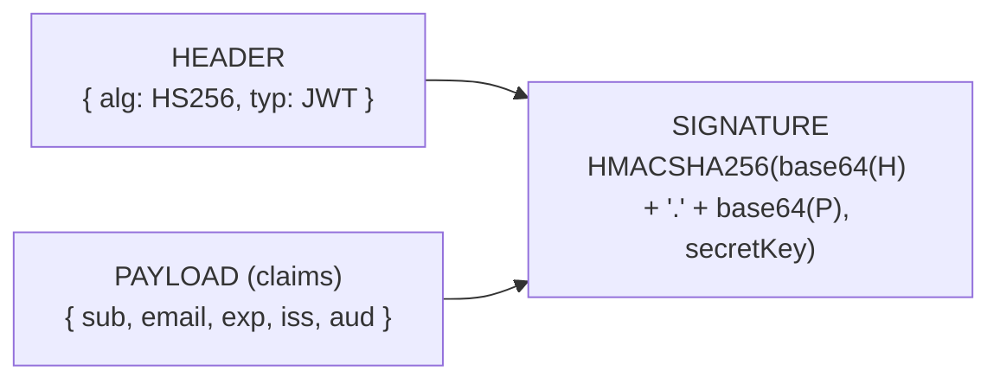

# JWT Structure, Claims & Validation in ASP.NET Core

A **JSON Web Token (JWT)** is a self-describing credential. The client sends it on every request; the API verifies it **without touching the database**. That single property — statelessness — explains almost every design decision and every limitation that follows.

---

## 1. Anatomy: Three Base64Url Segments

A JWT is one string with two dots in it:

```text
eyJhbGciOiJIUzI1NiIsInR5cCI6IkpXVCJ9  .  eyJzdWIiOiIxIiwiZW1haWwiOiJhQGIuY29tIn0  .  dBjftJeZ4CVP-mB92K27uhbUJU1p1r_wW1gFWFOEjXk
└──────────── HEADER ────────────┘     └──────────── PAYLOAD ────────────┘     └──────────── SIGNATURE ────────────┘
```



| Segment | Contains | Secret? |
| :--- | :--- | :--- |
| **Header** | Signing algorithm (`alg`), token type | No |
| **Payload** | The claims — the facts the API will trust | **No — see §2** |
| **Signature** | HMAC of header + payload, keyed with your `Jwt:Key` | The key is secret; the signature is not |

---

## 2. ⚠️ A Signature Is Not Encryption

**The payload is Base64Url-encoded, not encrypted.** Anyone holding the token can decode
and read it — paste one into <https://jwt.io> and every claim is visible in plain text.

The signature guarantees only that the payload **has not been modified** since you signed
it. It guarantees nothing about secrecy.

Consequences:

- **Never put a secret in a claim.** No passwords, no API keys, no internal notes.
- **Do not put anything you would not show the user in a claim.** A `"isFlaggedForFraud": true` claim is visible to the person you are investigating.
- **Keep claims small.** They travel on *every single request*. A claim list holding all of a user's permissions can push headers past proxy limits.

In TaskTracker's `TokenService`, the claims are just `sub` (user id), `email`, and `jti`
(a unique token id). That is the right size.

---

## 3. Standard Claims Worth Knowing

`JwtRegisteredClaimNames` holds the IETF-standard short names:

| Claim | Meaning | Validated by |
| :--- | :--- | :--- |
| `sub` | **Subject** — who the token is about. Your `User.Id`. | You, in `ICurrentUser` |
| `iss` | **Issuer** — who minted it (`"TaskTracker"`) | `ValidateIssuer = true` |
| `aud` | **Audience** — who it is meant for (`"TaskTracker.Client"`) | `ValidateAudience = true` |
| `exp` | **Expiry** — Unix seconds | `ValidateLifetime = true` |
| `iat` | Issued-at | — |
| `jti` | Unique token id. Useful if you ever build a denylist. | — |

`iss` and `aud` matter more than they look. Without them, a token minted by a *different*
service that happens to share your signing key would be accepted by your API. They scope a
token to one issuer and one intended recipient.

---

## 4. The Claim-Name Remapping Trap

You write `sub`. You read it back — and it is not there.

```csharp
// TokenService.cs — what you WRITE
new Claim(JwtRegisteredClaimNames.Sub, user.Id.ToString())   // "sub"

// ICurrentUser — what you must READ
accessor.HttpContext?.User.FindFirstValue(ClaimTypes.NameIdentifier)
// "http://schemas.xmlsoap.org/ws/2005/05/identity/claims/nameidentifier"
```

`JwtSecurityTokenHandler.DefaultInboundClaimTypeMap` is a static dictionary that rewrites
short JWT claim names into long WS-Federation URIs as the token is read. It is a
compatibility holdover from the WIF era, and it costs every newcomer an afternoon.

Two valid fixes — pick one and be consistent:

```csharp
// Option 1: accept the mapping, read the mapped name.
user.FindFirstValue(ClaimTypes.NameIdentifier)

// Option 2: turn it off in Program.cs, before AddAuthentication().
JwtSecurityTokenHandler.DefaultInboundClaimTypeMap.Clear();
// now FindFirstValue("sub") works
```

---

## 5. Validation Parameters — What Each One Actually Stops

```csharp
options.TokenValidationParameters = new TokenValidationParameters
{
    ValidateIssuerSigningKey = true,   // ← the only one that stops forgery
    ValidateIssuer   = true,
    ValidateAudience = true,
    ValidateLifetime = true,
    ValidIssuer   = builder.Configuration["Jwt:Issuer"],
    ValidAudience = builder.Configuration["Jwt:Audience"],
    IssuerSigningKey = new SymmetricSecurityKey(
        Encoding.UTF8.GetBytes(builder.Configuration["Jwt:Key"]!)),
    ClockSkew = TimeSpan.FromSeconds(30),
};
```

| Parameter | Turned off → what an attacker can do |
| :--- | :--- |
| `ValidateIssuerSigningKey` | Forge any token with any claims. **Catastrophic.** |
| `ValidateLifetime` | Replay a token stolen a year ago, forever. |
| `ValidateIssuer` / `ValidateAudience` | Reuse a token from another system sharing the key. |

**`ClockSkew` deserves attention.** The default is **5 minutes**, not zero. It exists
because a client's clock and a server's clock drift, and rejecting a token that expired
2 seconds ago by one machine's reckoning is user-hostile. But it also means a token with a
15-minute lifetime is really valid for up to 20. Set it to 30 seconds and know the number
rather than inheriting a surprise.

---

## 6. HMAC vs RSA — Symmetric vs Asymmetric Signing

TaskTracker uses `HmacSha256` with a `SymmetricSecurityKey`: **the same key signs and
verifies.** That is fine when one service does both.

The moment a *second* service needs to verify your tokens, symmetric signing forces you to
share the signing key with it — and any service that can verify can now also forge. That is
when you switch to RSA (`RS256`): a private key signs, a public key verifies, and the public
key is safe to hand out. Auth0, Entra ID, and every OIDC provider work this way.

Not needed here. Worth recognizing when you see `RS256` in the wild.

---

## 7. Where the Client Stores the Token

| Storage | Vulnerable to | Notes |
| :--- | :--- | :--- |
| `localStorage` | **XSS** — any injected script can read it | Simple, survives refresh. What TaskTracker uses. |
| In-memory (JS variable) | Nothing persistent | Lost on refresh; needs a refresh token to recover |
| `httpOnly` cookie | **CSRF** — but JS cannot read it | Needs `SameSite` + anti-forgery tokens |

There is no free option. `localStorage` + a short access-token lifetime is the pragmatic
choice for a learning SPA; the mitigation for XSS is not to move the token, it is to not
have XSS.

---

## 8. The Statelessness Tradeoff

The API never asks the database whether a token is still good. That is what makes JWTs fast
and horizontally scalable. It is also why:

- **Logout cannot invalidate an access token.** Deleting it client-side stops *that* client. A copy already stolen keeps working until `exp`.
- **A demoted or deleted user keeps their old permissions** until their token expires.

The standard answer is not "make JWTs stateful" — it is **short access tokens plus a
stored, revocable refresh token**. See Phase B in [`docs/more-features.md`](../../docs/more-features.md).

---

## Related

- [Password Hashing](./Password%20Hashing.md) — how the credential is verified before a token is issued
- [Global Query Filters and Data Scoping](./Global%20Query%20Filters%20and%20Data%20Scoping.md) — what the `sub` claim is used for once it arrives
- [IDOR and 404 vs 403](./IDOR%20and%20404%20vs%20403.md) — authentication is not authorization
