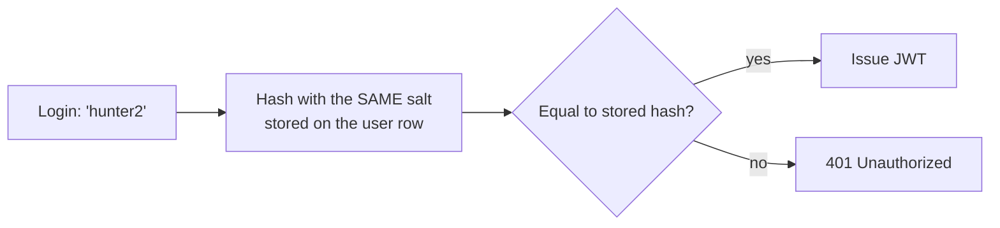

# Password Hashing: Salts, Slow Hashes & `PasswordHasher<T>`

Storing passwords is the one place in a backend where "clever" is always wrong and the
boring, framework-provided answer is always right. This doc explains *why* the boring
answer is right, so the reasoning transfers.

---

## 1. Hashing Is Not Encryption

| | Encryption | Hashing |
| :--- | :--- | :--- |
| Direction | Two-way — `decrypt(encrypt(x)) == x` | **One-way** — no `unhash()` exists |
| Needs a key | Yes | No |
| Right for passwords | **No** | **Yes** |

Encryption is wrong for passwords because a decryption key exists *somewhere*, and whoever
steals your database usually steals your config too. Hashing has no key to steal: you verify
a login by hashing the submitted password and comparing hashes, never by recovering the
original.



---

## 2. Why a Salt

A plain hash of a password is not enough. Two problems:

1. **Identical passwords produce identical hashes.** One glance at the table shows you which users share a password — and cracking one cracks all of them.
2. **Rainbow tables.** Precomputed hash→password lookups for every common password already exist, freely downloadable.

A **salt** is random bytes mixed into the hash, unique per user:

```text
hash = KDF(password + salt)
```

Now the same password hashes differently for every user, and a precomputed table is useless
because it would have to be recomputed per salt.

**The salt is not a secret.** It is stored right next to the hash — it has to be, or you
could never verify a login. Its only job is to be *unique*, not hidden.

**In `PasswordHasher<T>` the salt is generated for you and embedded in the output string.**
That is why this surprises people:

```csharp
var hasher = new PasswordHasher<User>();
var a = hasher.HashPassword(user, "hunter2");
var b = hasher.HashPassword(user, "hunter2");
// a != b  ✅ correct and expected — different random salts
```

You therefore **never compare hashes with `==`**. Always:

```csharp
var result = hasher.VerifyHashedPassword(user, user.PasswordHash, submittedPassword);
```

`VerifyHashedPassword` reads the salt and parameters back out of the stored string and
recomputes with them.

---

## 3. Why a *Slow* Hash

SHA-256 is designed to be fast — a modern GPU computes billions per second. Fast is exactly
wrong for passwords: it means an attacker with your hash table can brute-force it quickly.

Password hashing uses a **KDF (Key Derivation Function)** deliberately made slow and
memory-hard: PBKDF2, bcrypt, scrypt, Argon2. `PasswordHasher<T>` uses **PBKDF2-HMAC-SHA256
with 100,000 iterations** (ASP.NET Core Identity V3 format).

The **work factor** (iteration count) is the tuning knob: high enough that an attacker's
brute force is impractical, low enough that your login endpoint stays responsive. ~100ms per
hash is the usual target. It also means **login is intentionally slower than every other
endpoint in your API** — that is a feature, not a performance bug to optimize away.

### What the stored string actually is

```text
AQAAAAIAAYagAAAAEG7...  ← base64 of: [version][PRF][iterations][saltLength][salt][subkey]
```

Everything needed to verify — and to recognize an outdated format — is packed in. Which
leads to a result people miss:

```csharp
if (result == PasswordVerificationResult.SuccessRehashNeeded)
{
    // The password was CORRECT, but hashed with older/weaker parameters.
    // You have the plaintext right now — the only moment you ever will.
    user.PasswordHash = hasher.HashPassword(user, req.Password);
    await db.SaveChangesAsync(ct);
}
```

This is how you upgrade an entire user base's hashing strength without a password reset.
Treat `SuccessRehashNeeded` as success, not failure.

---

## 4. Don't Leak Which Emails Exist

```csharp
var user = await db.Users.FirstOrDefaultAsync(u => u.Email == req.Email, ct);
if (user is null) return Results.Unauthorized();   // same response...

var result = hasher.VerifyHashedPassword(user, user.PasswordHash, req.Password);
if (result == PasswordVerificationResult.Failed) return Results.Unauthorized();  // ...as this
```

If "no such account" returned 404 and "wrong password" returned 401, anyone could feed your
endpoint an email list and learn exactly who has an account. That is **user enumeration**,
and it is a real finding in real pentests — it turns a breach elsewhere into a targeted
attack here.

The same rule applies to `/register`: returning `409 Conflict` on a duplicate email *is*
an enumeration channel. It is normally accepted as a usability tradeoff — the alternative is
"check your email" for both cases — but know that you are making the tradeoff.

**Timing is also a channel.** In the code above, a nonexistent user returns immediately
while a real user pays 100ms of PBKDF2. A determined attacker can measure that. The fix,
when it matters, is to hash against a dummy hash even when the user is not found so both
paths cost the same.

---

## 5. Why Refresh Tokens Are Hashed *Differently*

Phase B stores refresh tokens as a **plain SHA-256 hash**, not `PasswordHasher`. That looks
inconsistent. It isn't:

| | Password | Refresh token |
| :--- | :--- | :--- |
| Chosen by | A human — low entropy, guessable | `RandomNumberGenerator` — 256 bits, unguessable |
| Brute-forceable? | Yes → needs a slow KDF | No → a slow KDF buys nothing |
| Salt needed? | Yes (humans reuse passwords) | No (each value is already unique) |
| Looked up **by hash**? | No (looked up by email) | **Yes** — and a per-row random salt makes lookup-by-hash impossible |

A slow, salted hash for refresh tokens would be slower, no safer, and would break the
lookup. Different threat, different tool.

Both are hashed for the same underlying reason: **a database leak must not hand the attacker
working credentials.**

---

## 6. Rules

1. Never store plaintext. Never encrypt instead of hash. Never invent your own scheme.
2. Never log a password — not in a request logger, not in an exception, not "temporarily".
3. Never email a password back to a user. If you can, you stored it wrong.
4. Use `PasswordHasher<T>` (or bcrypt/Argon2). It is already in the box.
5. Handle `SuccessRehashNeeded`.
6. Enforce a minimum length (8+), not a maximum below ~128 and not composition rules — length beats symbol soup.
7. Send it over HTTPS only. A perfect hash protects the database, not the wire.

---

## Related

- [JWT Structure and Claims](./JWT%20Structure%20and%20Claims.md) — what gets issued once the password checks out
- [IDOR and 404 vs 403](./IDOR%20and%20404%20vs%20403.md) — authentication done, authorization still to do
