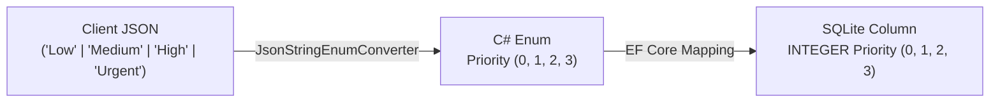
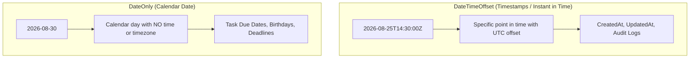

# Enums, DateOnly & Advanced Querying in EF Core & ASP.NET Core

This guide covers **Priority Levels (Enums)** and **Task Due Dates (`DateOnly`)**, focusing on database mapping, API serialization contracts, query filtering, and sorting behaviors with nullable fields.

---

## 1. Priority Levels & Enums in EF Core & REST APIs

### How Enums Flow Through the Stack



### Why Store as `int` but Serialize as `string`?

1. **In the Database (EF Core default = Integer)**:
   - Numerical comparison preserves severity ordering:
     $$\text{Urgent (3)} > \text{High (2)} > \text{Medium (1)} > \text{Low (0)}$$
   - `ORDER BY Priority DESC` works mathematically in SQL.
   - If stored as string (`HasConversion<string>()`), alphabetical sorting breaks: `"High"` < `"Low"` < `"Medium"` < `"Urgent"`.

2. **In API JSON (`JsonStringEnumConverter`)**:
   - Registered in `Program.cs`:
     ```csharp
     builder.Services.ConfigureHttpJsonOptions(options =>
     {
         options.SerializerOptions.Converters.Add(new JsonStringEnumConverter());
     });
     ```
   - Frontends receive and send clean, self-documenting strings (`"High"`, `"Urgent"`) instead of arbitrary numbers (`2`, `3`).

---

## 2. Date/Time Handling: `DateOnly` vs. `DateTimeOffset`



### The Timezone Shift Trap
When using `DateTime` or `DateTimeOffset` for a deadline:
- A user in New York picks deadline **August 30**.
- If stored with timezone or converted to UTC, it becomes `2026-08-29 20:00:00 UTC`.
- A user in London or Tokyo sees the task due on **August 29**!

### The Solution: `DateOnly?` (.NET 6+, EF Core 8+)
- A deadline is a calendar date: "Finish by August 30th", regardless of timezones.
- SQLite stores `DateOnly` as ISO-8601 string `YYYY-MM-DD` (`TEXT`).
- In SQLite, lexicographical string comparison on ISO dates matches chronological comparison (`"2026-08-29" < "2026-08-30"`).

---

## 3. Advanced Querying & Overdue Logic

In `ListTasks.cs`:

```csharp
var today = DateOnly.FromDateTime(DateTime.UtcNow);

// Exact Due Date: /api/tasks?dueDate=2026-08-30
if (q.DueDate is DateOnly dueDate)
    query = query.Where(t => t.DueDate == dueDate);

// Deadline Range: /api/tasks?dueBefore=2026-08-31
if (q.DueBefore is DateOnly dueBefore)
    query = query.Where(t => t.DueDate != null && t.DueDate <= dueBefore);

// Overdue Tasks: /api/tasks?isOverdue=true
// A task is overdue ONLY if it is not done AND has a due date in the past
if (q.IsOverdue is true)
    query = query.Where(t => !t.IsDone && t.DueDate != null && t.DueDate < today);
else if (q.IsOverdue is false)
    query = query.Where(t => t.IsDone || t.DueDate == null || t.DueDate >= today);
```

---

## 4. Sorting with Nullable Columns in LINQ

When sorting by a nullable column (like `DueDate?` ascending):
- In raw SQL/SQLite, `NULL` values may sort before non-null values.
- In task lists, users want **tasks with imminent deadlines first**, and tasks without deadlines (`null`) at the very end.

```csharp
IOrderedQueryable<TaskItem> orderedQuery = q.SortByOrDefault switch
{
    "title"    => desc ? query.OrderByDescending(t => t.Title) : query.OrderBy(t => t.Title),
    "isDone"   => desc ? query.OrderByDescending(t => t.IsDone) : query.OrderBy(t => t.IsDone),
    "priority" => desc ? query.OrderByDescending(t => t.Priority) : query.OrderBy(t => t.Priority),
    "dueDate"  => desc
        ? query.OrderByDescending(t => t.DueDate.HasValue).ThenByDescending(t => t.DueDate)
        : query.OrderByDescending(t => t.DueDate.HasValue).ThenBy(t => t.DueDate),
    _          => desc ? query.OrderByDescending(t => t.CreatedAt) : query.OrderBy(t => t.CreatedAt),
};
```

> [!TIP]
> `OrderByDescending(t => t.DueDate.HasValue)` places `true` (has a due date) before `false` (no due date), ensuring clean, predictable ordering regardless of sort direction.
