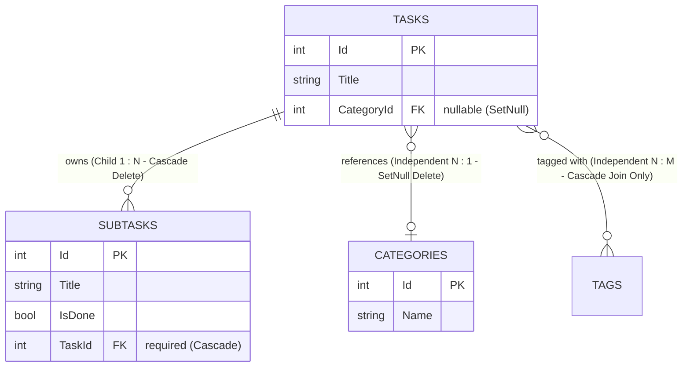

# Child Entities, Aggregate Roots & Cascade Deletes

In domain-driven design and relational databases, entities are categorized as either **Independent Entities** or **Child / Dependent Entities**. 

---

## 1. Independent vs. Child (Dependent) Entities



| Concept | Category / Tag (Independent) | Subtask (Child / Dependent) |
| :--- | :--- | :--- |
| **Can exist on its own?** | Yes. A category exists even with 0 tasks. | No. A subtask cannot exist without a parent task. |
| **Foreign Key Nullability** | `int? CategoryId` (Nullable) | `int TaskId` (Non-nullable / Required) |
| **Parent Deletion Behavior** | `DeleteBehavior.SetNull` (Tasks become uncategorized). | `DeleteBehavior.Cascade` (All subtasks are deleted with parent). |
| **Architectural Concept** | Standalone domain entity. | Owned child entity of the `TaskItem` **Aggregate Root**. |

---

## 2. Configuring Relationships in EF Core Fluent API

### Child Entity Configuration (`SubtaskConfiguration.cs`):

```csharp
public class SubtaskConfiguration : IEntityTypeConfiguration<Subtask>
{
    public void Configure(EntityTypeBuilder<Subtask> builder)
    {
        // 1. Property constraints
        builder.Property(s => s.Title)
            .HasMaxLength(200)
            .IsRequired();

        // 2. Indexes for fast lookup
        builder.HasIndex(s => s.TaskId);
        builder.HasIndex(s => s.IsDone);

        // 3. 1:N Relationship with Cascade Delete
        builder.HasOne(s => s.Task)
            .WithMany(t => t.Subtasks)
            .HasForeignKey(s => s.TaskId)
            .OnDelete(DeleteBehavior.Cascade);
    }
}
```

### Delete Behaviors in EF Core:
- **`DeleteBehavior.Cascade`**: When the principal (`TaskItem`) is deleted, all dependent entities (`Subtasks`) are deleted automatically by the database engine.
- **`DeleteBehavior.SetNull`**: When the principal (`Category`) is deleted, the dependent's foreign key (`TaskId.CategoryId`) is set to `NULL`.
- **`DeleteBehavior.Restrict` / `NoAction`**: Prevents deletion of the principal if any dependent rows still exist.

---

## 3. Nested REST API Route Design

Because a `Subtask` is an owned child entity, its lifecycle is tied to the parent `TaskItem`. We express this via **nested REST routes**:

| Action | Route | Purpose |
| :--- | :--- | :--- |
| **List** | `GET /api/tasks/{taskId}/subtasks` | List all checklist items for a specific task. |
| **Create** | `POST /api/tasks/{taskId}/subtasks` | Add a new subtask to a task. |
| **Update** | `PUT /api/tasks/{taskId}/subtasks/{subtaskId}` | Update title or toggle `isDone`. |
| **Delete** | `DELETE /api/tasks/{taskId}/subtasks/{subtaskId}` | Delete a specific subtask. |

### 🔒 Route Integrity Principle:
Notice that `Update` and `Delete` handlers include **both** `taskId` and `subtaskId` in their query:

```csharp
// Direct SQL DELETE ensuring the subtask belongs to the specified task
var rowsDeleted = await db.Subtasks
    .Where(s => s.Id == subtaskId && s.TaskId == taskId)
    .ExecuteDeleteAsync(ct);

if (rowsDeleted == 0) return Results.NotFound();
```
This prevents a malicious client from mutating or deleting a subtask belonging to Task #2 using a URL targeting Task #1 (`/api/tasks/1/subtasks/99`).
