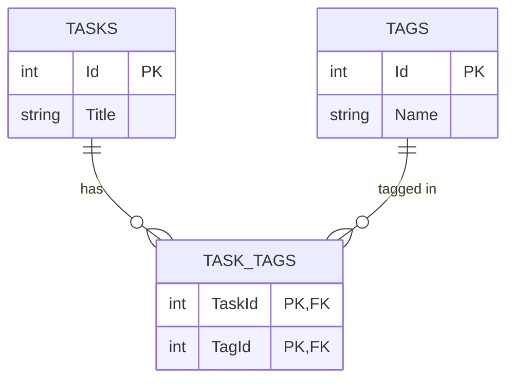

# Many-to-Many (`N : M`) Relationships & `UsingEntity(...)` in EF Core

In EF Core 5+, **Many-to-Many (`N : M`)** relationships can be modeled using **Skip Navigations** (`List<Tag>` on `TaskItem`, `List<TaskItem>` on `Tag`). This allows your application code to interact with collections directly without manually querying and instantiating intermediate join records.

---

## 1. What Happens Under the Hood?

In relational databases (like SQLite, PostgreSQL, SQL Server), two tables cannot reference each other with a foreign key directly for an `N : M` relationship. Instead, an intermediate **Join Table** is required:



---

## 2. Why Do We Need `UsingEntity(...)`?

By default, if you only write:
```csharp
builder.HasMany(t => t.Tags).WithMany(t => t.Tasks);
```

EF Core will automatically create a shadow join table for you, but:
- **Table Name**: Defaults to combining entity names alphabetically (e.g., `TagTaskItem`).
- **Column Names**: Defaults to `TagsId` and `TasksId`.
- **Index Configuration**: Defaults are applied without explicit index customization.

Using `.UsingEntity(...)` provides **complete architectural control** over your database schema:

```csharp
builder.HasMany(t => t.Tags)
    .WithMany(t => t.Tasks)
    .UsingEntity(
        "TaskTags", // Explicit join table name

        // 1. Relationship from Join Table -> Tag (Left)
        l => l.HasOne(typeof(Tag))
              .WithMany()
              .HasForeignKey("TagId")
              .OnDelete(DeleteBehavior.Cascade),

        // 2. Relationship from Join Table -> TaskItem (Right)
        r => r.HasOne(typeof(TaskItem))
              .WithMany()
              .HasForeignKey("TaskId")
              .OnDelete(DeleteBehavior.Cascade),

        // 3. Keys and Indexes
        j =>
        {
            j.HasKey("TaskId", "TagId"); // Composite Primary Key
            j.HasIndex("TagId");         // Index for reverse lookups
        });
```

### Key Benefits of This Configuration:

| Configuration Element | Purpose & Why It Matters |
| :--- | :--- |
| **`"TaskTags"`** | Clean, intentional table naming that aligns with SQL naming standards. |
| **`"TagId"`, `"TaskId"`** | Explicit column naming instead of framework-generated names. |
| **`j.HasKey("TaskId", "TagId")`** | **Composite Primary Key**: Ensures a task cannot have the exact same tag linked more than once (prevents duplicate join records). |
| **`j.HasIndex("TagId")`** | The composite PK automatically indexes queries starting with `TaskId`. Adding an explicit index on `TagId` allows fast, efficient reverse queries (*"Find all tasks tagged with #urgent"*). |
| **`DeleteBehavior.Cascade`** | **Safe Cascading**: When a `TaskItem` or `Tag` is deleted, its matching row in `TaskTags` is deleted automatically. Neither the sibling `Tag` nor the sibling `TaskItem` is deleted. |

---

## 3. Where Should We Put the Relationship Configuration?

### Technically: It is Symmetric
In EF Core, Many-to-Many relationships are symmetric. Defining the relationship in `TagConfiguration` produces the exact same database schema:

```csharp
// In TagConfiguration.cs (produces the same schema)
builder.HasMany(tag => tag.Tasks)
       .WithMany(task => task.Tags)
       .UsingEntity("TaskTags", ...);
```

### Architectural Decision: The "Aggregate Root" Principle

Why place it in [`TaskItemConfiguration.cs`](file:///c:/Users/dungd/OneDrive/Desktop/Work/TEST/TaskTracker/server/TaskTracker.Api/Data/Configurations/TaskItemConfiguration.cs)?

1. **Central Domain Focus**: `TaskItem` is the central aggregate root of our application (TaskTracker). Auxiliary entities like `Category` and `Tag` exist to organize tasks.
2. **Single Source of Truth**: Placing all task relationships in `TaskItemConfiguration.cs` (`TaskItem -> Category` for 1:N and `TaskItem -> Tag` for N:M) lets any developer understand all relationships connected to a task in one file.
3. **Golden Rule**: **Configure the relationship in only ONE configuration file**, never both. Configuring it in both places can lead to conflicting rules or schema ambiguity in EF Core model building.
