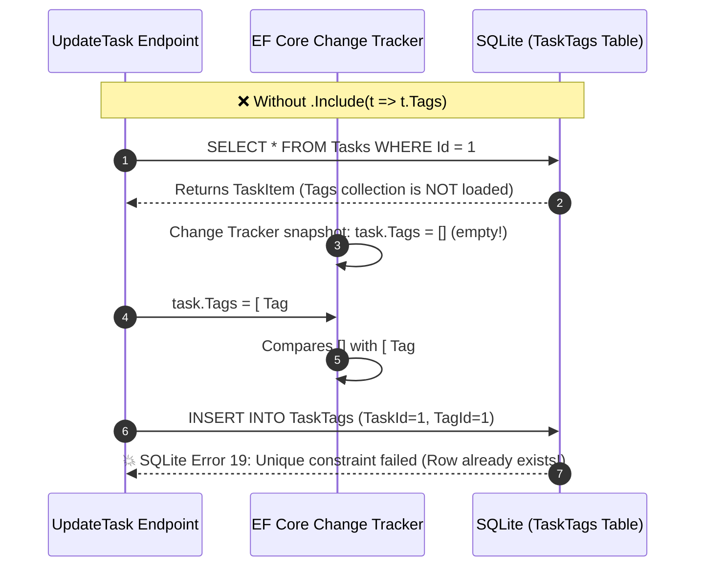
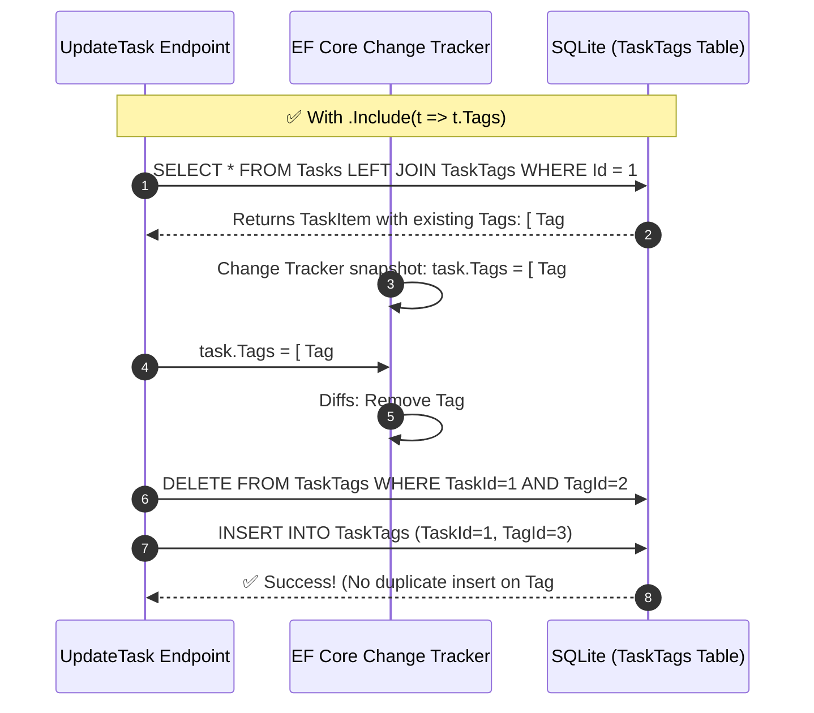

# Updating Many-to-Many Collections & EF Core Change Tracking

When updating relational data (especially **Many-to-Many** `N : M` or **One-to-Many** `1 : N` collections), one of the most common pitfalls is calling `FindAsync` without eager loading the existing relationship.

---

## 1. The Problem: The Duplicate Key Exception (`SQLite Error 19`)

Consider this scenario in an update endpoint:

```csharp
// ❌ Pitfall: Loading only the scalar columns of TaskItem
var task = await db.Tasks.FindAsync([id], ct);

// Reassigning tags
task.Tags = newTags;

await db.SaveChangesAsync(ct);
```

### The Error:
```text
Microsoft.Data.Sqlite.SqliteException: SQLite Error 19: 
'UNIQUE constraint failed: TaskTags.TaskId, TaskTags.TagId'
```

---

## 2. Under the Hood: Why Did This Happen?

EF Core manages relationships using its **Change Tracker**. To know which rows in a join table (like `TaskTags`) to `INSERT` or `DELETE`, EF Core must know the **original state** of the collection in memory.



### The Breakdown:
1. `db.Tasks.FindAsync([id])` loads **only** the scalar columns of `TaskItem` (`Id`, `Title`, `IsDone`, `CategoryId`). It does **not** load related rows from the `TaskTags` join table.
2. In C#, `public List<Tag> Tags { get; set; } = [];` initializes to an empty list. The Change Tracker records `task.Tags` as empty (`[]`).
3. When you assign `task.Tags = tags;` (where `tags` already contains `Tag #1` in the database):
   - The Change Tracker diffs `[]` vs `[Tag #1]`.
   - It assumes `Tag #1` is a **new relationship** that needs to be inserted into `TaskTags`.
4. When `SaveChangesAsync` executes:
   - EF Core issues `INSERT INTO TaskTags (TaskId, TagId) VALUES (1, 1)`.
   - The database already has `(TaskId=1, TagId=1)` from when the task was created.
   - SQLite throws a **Unique Constraint Failure**.

---

## 3. The Solution: Eager Load with `.Include(t => t.Tags)`

When updating a navigation collection, you **must** instruct EF Core to load the existing collection from the database:

```csharp
// ✅ Correct: Load the task AND its existing tags into the Change Tracker
var task = await db.Tasks
    .Include(t => t.Tags)
    .FirstOrDefaultAsync(t => t.Id == id, ct);

if (task is null) return Results.NotFound();

if (req.TagIds is not null)
{
    var (tagError, tags) = await db.ValidateTagsExistAsync(req.TagIds, ct);
    if (tagError is not null) return tagError;

    // EF Core calculates the exact diff:
    // - Removed tags -> DELETE FROM TaskTags
    // - Added tags   -> INSERT INTO TaskTags
    // - Kept tags    -> NO-OP (no duplicate insert!)
    task.Tags = tags;
}

await db.SaveChangesAsync(ct);
```



---

## 4. Key Rules of Thumb

| Scenario | Best Method | Why |
| :--- | :--- | :--- |
| **Read-only query** | `db.Tasks.AsNoTracking().Select(...)` | Fastest performance; projection fetches only needed fields without tracking overhead. |
| **Updating only scalar fields** (`Title`, `IsDone`, `CategoryId`) | `db.Tasks.FindAsync([id])` | Fast primary key lookup. No joins needed. |
| **Updating a collection relationship** (`Tags`, `Subtasks`) | `db.Tasks.Include(t => t.Tags).FirstOrDefaultAsync(...)` | Required so Change Tracker can perform differential updates on join tables. |
